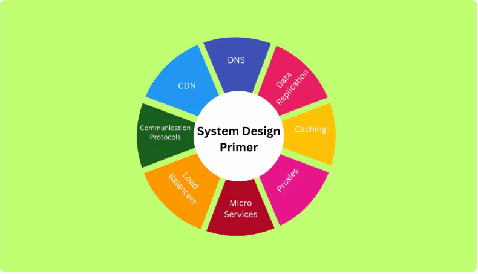
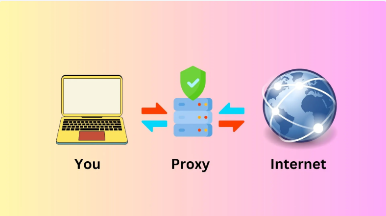

<!-- START doctoc generated TOC please keep comment here to allow auto update -->
<!-- DON'T EDIT THIS SECTION, INSTEAD RE-RUN doctoc TO UPDATE -->
**Table of Contents** 

- [INTRODUCTION TO SYSTEM DESIGN](#introduction-to-system-design)
  - [*Let's get started preparing for your next interview*](#lets-get-started-preparing-for-your-next-interview)
  - [Design Methods in System Design](#design-methods-in-system-design)
  - [Deeper System Design Concepts](#deeper-system-design-concepts)
    - [Performance vs Scalability](#performance-vs-scalability)
    - [Latency vs Throughput](#latency-vs-throughput)
    - [Consistency Patterns and Availability Patterns](#consistency-patterns-and-availability-patterns)
      - [Consistency Patterns](#consistency-patterns)
      - [Availability Patterns](#availability-patterns)
- [Advanced Concepts in System Design](#advanced-concepts-in-system-design)
- [Components of System Design](#components-of-system-design)
  - [1. __Microservices and Service Discovery__](#1-__microservices-and-service-discovery__)
  - [2. __Database Systems: Relational Database Management System (RDBMS) and NoSQL__](#2-__database-systems-relational-database-management-system-rdbms-and-nosql__)
    - [Characteristics of RDBMS database.](#characteristics-of-rdbms-database)
    - [<u>NoSQL</u>](#unosqlu)
    - [Characteristics of NoSQL database.](#characteristics-of-nosql-database)
  - [3. Communication Protocols](#3-communication-protocols)
- [Best Approach to System Design Interview Questions](#best-approach-to-system-design-interview-questions)
    - [1. Requirements clarification](#1-requirements-clarification)
    - [2. Estimation of resources](#2-estimation-of-resources)
    - [3. System interface definition](#3-system-interface-definition)
    - [4. Defining Data model](#4-defining-data-model)
    - [5. High-level design](#5-high-level-design)
    - [6. Detailed design](#6-detailed-design)
    - [7. Identifying and resolving bottlenecks](#7-identifying-and-resolving-bottlenecks)
- [Sample System Design Interview Questions and Approaches to Solutions](#sample-system-design-interview-questions-and-approaches-to-solutions)
  - [Reference for this guide: Design Gurus](#reference-for-this-guide-design-gurus)

<!-- END doctoc generated TOC please keep comment here to allow auto update -->

# INTRODUCTION TO SYSTEM DESIGN




System Design is a step-by-step process of defining and designing a particular software's architecture, modules, components and interfaces inorder for it to meet specific needs.   
It is important since it improves system performance, scalability, reliability, and security.  
Most System Design Interviews are meant to test the interviewee's ability to build complex application architectures from scratch.  
This markdown file will help you to understand the essence of system design and various concepts from basics to advanced.

## *Let's get started preparing for your next interview*  

***System Design?***  is used to prepare the architecture of the software or application based on requirements, which can be either *functional and non-functional*. Funtional Requirements are based on features the client needs in his/her application while Non-Functional requirements include scalability, high availability, consistency, etc. By Scalability, we mean how to make applications efficient in case the traffic increases.  

## Design Methods in System Design

There are a wide range of design methods and techniques to design the system's architecture and they are based on the project's requirements. They include;
1.  __Architectural Design__  
This is the base of the system design which describes the infrastructure, model, view, components, and interaction. This design includes client-server interaction, microservices, etc.
1. __ERD Diagram__  __(Entity-Relationship Diagram)__  
It is mainly used in designing the application's database structure.  
In this method, one can define multiple database schemas, add entities in each schema, add multiple attributes for each entity as well as connect the entities of two different schemas if a relationship exists between them.  
1.  __UML Diagram__  __(Unified Modeling Language)__  
Used to prepare modeling software systems and contains different diagrams to represent the different aspects of the system such as _activity diagrams, class diagrams, sequence diagrams, etc._  
1. __Class Diagrams__  
They generally provide an overview of the system's data and functionality as they are used to represent classes and can contain class attributes, methods, and relationships between multiple classes.  
1. __Sequence Diagrams__  
They represent the interaction between the various components of the system and are used to model the behavior of the system. Such as by specifying instances when users enter specific inputs at the frontend side of the application or how the application should process the data and return the response.

## Deeper System Design Concepts
### Performance vs Scalability
1. __Performance:__ - It can best be measured by how fast it is for an application to load. Longer loading time can decrease your websites traffic as users are most likely to navigate to faster loading sites. There are various mechanisms which can be used to increase the application's performance and serve resources faster such as caching.  
1. __Scalability__ - Refers to the ability to scale the application.It can be achieved by distributing the load across multiple servers or increasing the single server's capacity.   
For example, For the case of Google, when the number of users increases, they either increase the capacity of a particular server or develop a new server, in an attempt to have it provide normal functions despite an increase in users.

###  Latency vs Throughput  
1. __Latency__ is a measurement of the time delay to complete a single request or data operation. It can as well be said to be a network delay that occurs due to Geographical distance, transport protocol, or network infrastructure and is measured in the Milliseconds.  
*NB :  Lower latency is required for the best user experience and vice versa.*
2. __Throughput__ is the number of operations the system can handle in a particular time or the number of data passed via network request in a given time and is measured in megabytes (MB) per second.  
### Consistency Patterns and Availability Patterns
1. __Consistency__ ensures that all nodes in the system read the same data at a particular time. 
1. __Availability__: The system's availability ensures that each request receives a response either with fresh or old data.  
*NB: When high uptime is needed, availability is important*
<hr>

#### Consistency Patterns
<details>
<summary>Strong consistency: Ensure that each request should get the most recent data.</summary>
Synchronized communication is required to achieve strong consistency.
</details>
<details>
<summary>Eventual Consistency: Allow temporary inconsistencies to be resolved soon. </summary>
It prioritizes availability over consistency.
</details>
<details>
<summary>Weak Consistency: Focuses on the fast access.</summary>
</details>

#### Availability Patterns 
<details>
<summary>Load Balancing: Upcoming requests can be distributed across multiple servers to achieve high availability.</summary>
</details>
<details>
<summary>Retry and timeout strategies: Retry mechanism can be implemented to process the request after every interval if the system fails or is not available.</summary>
</details>

# Advanced Concepts in System Design

 1. __CDN (Content Delivery Network)__  
It is a distributed server network located at different geo-locations and is used to deliver content like images, various data, etc., from the server.  
It delivers the resource faster, decreases latency (network delay), and improves the application's performance.
Here information is cached to nearby servers such that the information is near a user upon a request which he/she makes to the server instead of retrieving data from the original server always.  
1. __DNS (Domain Name System)__  
It allows users to access the website and its resources using the domain name by mapping the unique domain name with a unique IP address.
Example of a DNS is as shown below.
```
(www.example.com)
```
1. __Caching or High-Speed Storage__
It is a mechanism to serve resources faster which works between the web application and the source of the data.
When a requesting is made by a user, data is first checked in the cache storage. If it's found, data is returned and if not found, it requests the database or source of the data, stores it in the cache storage, and sends data to the application.  
*NB// Cookies are used to store cache on browsers.*  
1. __Proxies (Proxy Server)__



Proxies work between the client of the application and the internet and are used for caching.  
 
# Components of System Design

## 1. __Microservices and Service Discovery__
This  is one of the most used system design approaches to prepare software architecture. It breaks down complex applications into small services, such that each service works independently and accomplishes specific tasks.  
Some concepts related to microservices include:
- ***Service Identification:*** Every microservice has a unique ID and name for its identification.
- ***Dynamic Service Discovery:*** Each microservice can dynamically find other services located in the same network therefore scaling and load balancing becomes easy.

## 2. __Database Systems: Relational Database Management System (RDBMS) and NoSQL__
When you need to store structured data, you can choose the RDBMS for the software or application. This makes it easier to access the data from the database and connect it with other data as they are stored in the table format.  
*NB: SQL databases are built on top of RDBMS.*
### Characteristics of RDBMS database.
- Stores data in table format.
- The database can’t be scaled horizontally, but can be scaled vertically.
- SQL is a query language for the RDBMS databases.
- Accessing data from the RDBMS database is slow.

### <u>NoSQL</u>  
NoSQL database mean a non-SQL database. It stores the data in key-value pairs instead of in table format. It can be used when one is required to store unstructured data in the database.
### Characteristics of NoSQL database.
- Store data in key-value pairs format.
- It is horizontally scalable, as you can add new key-value pairs for new attributes.
- Each record can contain different key-value pairs.
- It is faster than RDBMS databases.
- It supports frequent changes in the database.  
## 3. Communication Protocols
*Protocols* mean rules and *communication protocols* refer to the rules to communicate or exchange data between two systems which can be server or client.  
Various communication protocols include;
<details>
<summary>HTTP/HTTPS (Hypertext Transfer Protocol)</summary>
HTTPS is a secure version of HTTP. The two are used in web-based communication. However, it is recommended to have one use HTTPS as it's way more secure.
</details>
<details>
<summary>TCP/IP (Transmission Control Protocol)/ (Internet Protocol)</summary>
It is used to communicate over the internet e.g. in chat applications.
</details>
<details>
<summary>UDP (User Datagram Protocol)</summary>
Mainly used for live streaming, video calls, etc., where data loss can be tolerable.
</details>
<details>
<summary>WebSockets</summary>
Used for bi-directional duplex communication as it builds connection between two web applications.
</details>
<br/>
<br/>

# Best Approach to System Design Interview Questions
### 1. Requirements clarification 
There can be two types of requirements: function requirements and non-function requirements. Functional requirements are those in the application which users interact with e.g. authentication and navigation, while as non-functional requirements are the requirements to improve the application's capabilities.e.g. high availability and scalability. 
### 2. Estimation of resources
To estimate resources, one has to have a rough idea of the expected outcome.e.g. while selecting the resources for a server,one should keep in mind how many requests it will receive per day or second, as well as how much of data will be stored in a database.
### 3. System interface definition
Third step is designing the system interface.e.g. defining the API endpoints and what to expect from each API endpoint.
### 4. Defining Data model
Based on the type of data to be stored, choice of database to be used can vary e.g. 
NoSQL databases are for unstructured data, RDBMS are for structured data and graph databases to manage many to many relationships.
### 5. High-level design
Next thing is to design high-level components.Here one needs to decide how to connect different components of the system with each other. Functional requirements of the application can be fulfilled in this step.
### 6. Detailed design
Once the basic design of the application is created, there's need to improve the system design through analyzing the system to fulfill the non-functional requirements.  
One can analyze the system through the following methods;
- How to use caching to improve the performance of the application?
- How do we scale the application via load balancing?
- Should you use the CDN for caching, or are cookies enough?
- How would you handle the failure of the application?
- Should you distribute the data across multiple databases?
- How will you replicate the database?
### 7. Identifying and resolving bottlenecks
The sample bottlenecks which can be addressed include;

- Can the system fail in any scenario? If yes, how will you handle it?
- How do you monitor the performance of the system and issues in the system?
- Do you have enough replicas of the database to handle the failure?
<br/>
<br/>

# Sample System Design Interview Questions and Approaches to Solutions
<details>
<summary>How would you design a URL Shortening service similar to TinyURL?</summary>
You can discuss the above answer using the below approach.  

- How you will use the REST API to communicate with the server.
- How will you handle the 500 requests every second via load balancing?
- You can discuss using the relational database, as it doesn’t require horizontal scaling.
- You can discuss how you will prepare a table for relational database to map long URLs with short URLs.
- The critical point is how to shorten the long URL by providing a unique id to each shortened URL.
</details>
<details>
<summary>How would you design a Web Crawler?</summary>
Web crawlers allow the extraction of information from different web pages.   

You can discuss how you open multiple web pages in the web browser. However, it is important to know how many browser windows you will open simultaneously to crawl multiple web pages as too many windows may cause the device to run out of memory.
You can also discuss changing the web pages and domains dynamically.
</details>
<details>
<summary>How would you design Facebook and Instagram?</summary>  

- Talk about how you will handle the relationship between users in the database.
- Talk about how you will implement the chat features. You may talk about integrating third-party chatting applications.
- Furthermore, you can discuss how you will implement the authentication.
- Discuss algorithms to show trending or latest posts.
- Talk about handling user’s data in the database, as users will publish multiple posts.
- Discuss database replication to handle failures.
- Discuss data caching and load balancing.
</details>
<details>
<summary>How would you design the API rate limit?</summary>  
The API rate limiter allows one to make a particular number of API requests in a specified time. If the API request increases, it blocks the request for some time.

- Talk about rate-limit matrics. How many maximum requests do you want to allow per second?
- Talk about how you will handle multiple requests simultaneously.
- Talk about how you can keep count of requests. You may use the IP address received in the request header.
</details>

## Reference for this guide: [Design Gurus](https://www.designgurus.io/blog/system-design-primer-the-ultimate-guide)